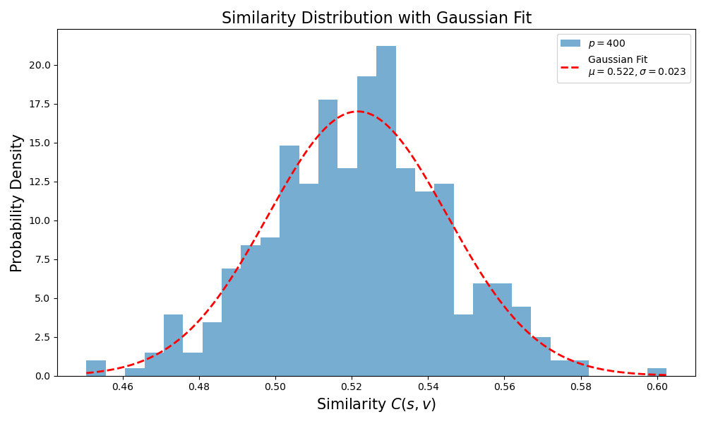

# 
 Computational_Physics_10

[toc]

考虑一个 $N$ 个格点的全连接Ising模型，其哈密顿量为：
$$H = -\frac{1}{2} \sum_{i \neq j} J_{ij} s_i s_j,$$
其中 $s_i = \pm 1$ 为格点的自旋状态，耦合强度矩阵 $J_{ij}$ 是对称的。接下来让我们定义 $p$ 个自旋态集合：
$$
\{\mathbf{v}^\mu\} = \{\mathbf{v}^1, \mathbf{v}^2, \cdots, \mathbf{v}^p\},$$
$\mathbf{v}^\mu$ 是可以任意选取的 $N$ 格点的自旋组态。对于一个给定的集合 $\{\mathbf{v}^\mu\}$，按照下述规则确定一个耦合强度矩阵：
$$J_{ij} \bigg|_{i \neq j} = \frac{1}{N} \sum_{\mu=1}^p v_i^\mu v_j^\mu, \quad J_{ii} = 0.$$
定义两个自旋构型 $\mathbf{u}$, $\mathbf{v}$ 的余弦相似度：
$$
S_C(\mathbf{u}, \mathbf{v}) = \frac{\left| \sum_i^N u_i v_i \right|}{\sqrt{\sum_i^N u_i^2} \cdot \sqrt{\sum_i^N v_i^2}} = \frac{1}{N} \left| \sum_i^N u_i v_i \right|.$$

## 1.单一参考构型 $p=1$

 考虑最简单的情况 $p = 1$，即初始的集合 $\{\mathbf{v}^\mu\}$ 只有一个元素 $\mathbf{v} = [v_1, v_2, \cdots, v_N]^T$。写出一个任意自旋态 
$\mathbf{s} = [s_1, s_2, \cdots, s_N]^T$ 对应的**能量 $E(\mathbf{s})$**。系统的**基态**是什么？**基态简并吗**？（2分）

<!--

考虑集合 $\{v^\mu\}$ 中仅有一个构型 $v$，耦合矩阵定义为：

$$
J_{ij} =v_i v_j,(i\neq j)\quad J_{ii} = 0
$$

能量函数写作：

$$
E(s) = -\frac{1}{2} \sum_{i \ne j} J_{ij} s_i s_j
= -\frac{1}{2N} \left( \sum_i v_i s_i \right)^2
$$
引入余弦相似度（归一化）：

$$
C(s, v) = \frac{1}{N} \sum_{i=1}^N s_i v_i
$$

则能量可写为：

$$
E(s) = -\frac{N}{2} C(s, v)^2
$$

最大余弦相似度 $|C(s, v)|=1$，即 $s = \pm v$ 时能量最小，对应基态能量为：

$$
E_\text{min} = -\frac{N}{2}
$$

因此基态有两个，分别是 $v$ 和 $-v$，简并度为 2。 -->

### 求能量
已知：

* 系统有 $N$ 个自旋：$s_i \in {-1, +1}$
* 只有一个参考构型 $v = (v_1, v_2, \dots, v_N)$，记作 \${v^\mu}\$ 中唯一的 \$v\$
* 耦合矩阵定义为：

  $$
  J_{ij} = \frac{1}{N} v_i v_j,\quad J_{ii} = 0
  $$
* 哈密顿量定义为：

  $$
  H = -\frac{1}{2} \sum_{i \ne j} J_{ij} s_i s_j
  $$

代入耦合矩阵后，有：

$$
E(s) = -\frac{1}{2} \sum_{i \ne j} \frac{1}{N} v_i v_j s_i s_j
= -\frac{1}{2N} \sum_{i \ne j} (v_i s_i)(v_j s_j)
$$

令 $x_i = v_i s_i$，则上式变为：

$$
E(s) = -\frac{1}{2N} \left[ \left( \sum_{i=1}^N x_i \right)^2 - \sum_{i=1}^N x_i^2 \right]
= -\frac{1}{2N} \left[ \left( \sum_{i=1}^N x_i \right)^2 - N \right]
$$

我们更关心的是能量与相似度之间的关系。注意到 $s$ 与 $v$ 的余弦相似度定义为：

$$
C(s, v) = \frac{1}{N} \sum_{i=1}^N s_i v_i
$$

$$N=1$$

<!-- 因为 $s_i, v_i \in {-1, +1}$，所以 $x_i = s_i v_i \in {-1, +1}$，从而： -->
则：

$$
\sum_{i=1}^N s_i v_i = \sum_{i=1}^N x_i = N \cdot C(s, v)
$$

$\cdot C(s, v)$ 表示不带绝对值的相似度。

代入能量表达式，有：

$$
E(s) = -\frac{1}{2N} \left[ (N \cdot C(s, v))^2 - N \right]
= -\frac{N}{2} C(s, v)^2 + \frac{1}{2}
$$

由于能量定义时省略常数项，并且$N=1$，最终我们可以写为：

$$
E(s) = -\frac{1}{2} S_C(s, v)^2
$$

### 基态分析：

* 能量最小时，$C(s, v)^2$ 最大
* $|C(s, v)| \leq 1$，所以能量最小值为：

  $$
  E_{\text{min}} = -\frac{N}{2}
  $$
* 当 $C(s, v) = \pm 1$，即 $s = v$ 或 $s = -v$，系统处于基态

### 简并性分析

由上，**系统的基态有两个，分别为 $s = v$ 与 $s = -v$，具有两重简并性**

## 2.模拟分析

2. 产生一个大小为 $p$ 的集合 $\{\mathbf{v}^\mu\}$。其中 $v_i^\mu = \text{rand}(-1, +1)$ 随机选取。

### i. Metropolis 模拟 ($p=1$)

取值 $N = 1000$, $p = 1$，且随机生成一个初态 $\mathbf{s}$，它和集合里唯一元素的**相似度** $S_C(\mathbf{s}, \mathbf{v})$ 是多少？现在用 metropolis 单自旋更新的方法来模拟 $H$ 的基态 ($\beta \to \infty$）。当系统能量不再变化的时候，你找到的 **$\mathbf{s}$ 是什么**，有什么**特点**？**$S_C(\mathbf{s}, \mathbf{v})$ 又是多少**？（2分）

#### 求$S_C(\mathbf{s}, \mathbf{v})$

耦合矩阵定义为：

$$
J_{ij} = \frac{1}{N} v_i v_j, \quad J_{ii} = 0
$$

能量函数为：

$$
E(s) = -\frac{N}{2} C(s, v)^2
$$（常数项无物理意义）

初始态 $s$ 与参考构型 $v$ 都为随机 $\pm 1$ 序列，故其初始余弦相似度近似为：

$$
C(s, v) \approx 0
$$

使用计算模拟来计算$C(s, v)$:

如图所示，随机初始化下s,v的相似度非常接近0。

#### 求基态$\mathbf{s}$

通过 Metropolis 算法在 $\beta \rightarrow \infty$ 下更新自旋，系统会逐渐趋于基态，即最大化 $|C(s, v)|$：

$$
C(s, v) \to \pm 1
$$

因此最终得到的自旋构型为 $v$ 或 $-v$，系统陷入其中一个基态，能量达到最小值：

$$
E = -\frac{N}{2}
$$

此时：

$$
s_\text{final} = \pm v, \quad C(s_\text{final}, v) = \pm 1
$$

经过计算模拟，得到结果：

最终s与v的相似度为$\pm 1$，说明最终得到的$s_\text{final} = \pm v$。

对多个系综平均，得到的平均相似度为0：

说明两个s的值出现的概率相同。

#### 总结：
- 得到的s:$s_\text{final} = \pm v$
- 特点：两个s的值出现的概率相同。
- $S_C(\mathbf{s}, \mathbf{v})$=1（包含绝对值）

### ii.带噪声扰动的初态集合（$p=10$）

ii. 取值 $N = 2000$, $p = 10$。产生一个初态集合 $\{\mathbf{s}^\mu\}$，其中 $\mathbf{s}^\mu$ 为将 $\mathbf{v}^\mu$ 加上噪声得到，其伪代码为：
$$\text{add\_noise}(\mathbf{v}, \delta) = [( \text{rand}() < \delta ? \text{rand}((-1, +1)) : \mathbf{v}_i) \text{ for } \mathbf{v}_i \text{ in } \mathbf{v}]$$
其中 $\delta \in [0, 1]$ 是噪声强度。现在取 $\delta = 0.5$。对得到的集合 $\{\mathbf{s}^\mu\}$ 都作演化，**给出末态 $\mathbf{s}^\mu$ 和对应无噪声的原始构型 $\mathbf{v}^\mu$ 的相似度 $S_C^\mu = S_C(\mathbf{u}^\mu, \mathbf{v}^\mu)$。你发现了什么？**（2分）
<!-- 
## 问题 2 (ii)：带噪声扰动的初态集合（$p=10$） -->

参考构型集合为 $\{v^\mu\}, \mu = 1, 2, \dots, 10$，每个构型通过如下方式添加噪声生成初始态：

$$
s_i^\mu =
\begin{cases}
\text{rand}(\pm 1), & \text{概率 } \delta = 0.5 \\
v_i^\mu, & \text{概率 } 1 - \delta
\end{cases}
$$

构造耦合矩阵：

$$
J_{ij} = \frac{1}{N} \sum_{\mu=1}^{p} v_i^\mu v_j^\mu
$$

每个扰动初态 $s^\mu$ 经 Metropolis 算法演化，最终态与原始构型 $v^\mu$ 的相似度定义为：

$$
C_\mu = \frac{1}{N} \sum_{i=1}^{N} s_i^\mu v_i^\mu
$$

实验结果如下：

实验结果显示，大多数 $C_\mu$ 接近 1，说明系统成功恢复原始构型，即便初始态中含有 50% 噪声。

这表明系统能从部分错误状态中恢复，表现出记忆稳定性。

### iii.不同 $p$ 下的相似度分布

iii. 保持 $N = 2000$ 并改变 $p$ 的值。**对于不同的 $p$ 值，计算 $S_C^\mu$ 的分布，并用直方图画出来。**这一分布随着 $p$ 的值改变出现了什么变化？这样的变化说明了什么？（2分）hint: $p$ 在此题可以在 50 - 400 间选取。为了得到更好的分布，你可以考虑对不同的 $\{\mathbf{v}^\mu\}$ 作系综平均。

我们通过模块化实现，对多个参考构型数量 $p$ 进行模拟，流程如下：

1. 随机生成 $p$ 个参考构型 $\{v^\mu\}$
2. 每个 $v^\mu$ 通过噪声 $\delta = 0.5$ 生成初始态 $s^\mu$
3. 构造耦合矩阵：

$$
J_{ij} = \frac{1}{N} \sum_{\mu=1}^{p} v_i^\mu v_j^\mu
$$

4. 初态经 Metropolis 算法演化至最终态 $s^\mu_{\text{final}}$
5. 计算每个构型的相似度：

$$
C_\mu = \frac{1}{N} \sum_{i=1}^{N} s_i^\mu v_i^\mu
$$

并将多个 $p$ 下的 $C_\mu$ 分布绘制为直方图：

<!-- todo -->
<!-- 1. 是否高斯分布->无记忆？ -->
<!-- 2. p多大的时候有记忆 -->

由上图可以发现：
- 当p较小的时候，相似度仍然为0，说明系统仍然能从部分错误状态中恢复，表现出记忆稳定性。
- 当p较大的时候，相似度开始呈现正态分布，均值偏离1，说明系列此时不能恢复原始构型，表现出无记忆性。
- 从图中不难发现，p越大，相似度的均值越低，说明无记忆性更强
- p越大，方差越小

接下来，我们探究两个问题：
1. p多大的时候开始失去记忆性？
2. “无记忆”状态下的分布是否有某种规律？又能说明什么？

#### 1. p多大的时候开始失去记忆性？

我们通过相似度的均值来判断**是否有记忆**：
做出$S_C$关于$p$的曲线，得到如下图：

由上图，初步判断p在200-250之间失去记忆性。

进一步缩小范围，得到：

上图数据有重叠。
可以看出在临界值250左右开始消失记忆性。

#### 2. 无记忆状态下的分布是否有某种规律？

不妨取p=400:

由上图不难看出，相似度的分布满足高斯分布。

### iv.解释与思考
iv. 你能解释你的发现吗？（2分）你还有什么别的思考？

#### 在250左右处突变
参考论文：Storing Infinite Numbers of Patterns in a Spin-Glass Model of Neural Networks

我们观察到相似度 $C(s, v)$ 的均值在 $p \approx 250$ 左右发生突变，这与 Hopfield 网络理论的容量极限 $p_{\text{max}} \approx 0.14 N$ 是一致的。这一突变对应从“有记忆”到“无记忆”状态的转变。

#### 非记忆处类似高斯分布
当 $p$ 进一步增大（例如 $p = 400$）时，相似度分布呈现高斯分布特征，说明系统最终状态趋于随机。此时能量面复杂、包含大量局部极小值，系统难以回到特定参考构型。

#### p 越大，方差越小的原因

在 $p$ 较大时，耦合矩阵 $J_{ij}$ 中包含了大量参考构型的平均信息，相当于在高维空间中对多个不同方向进行“加权平均”。当参考构型数量增加时，耦合矩阵的统计波动性减弱，自旋系统在 Metropolis 演化下的输出表现出更稳定的集中趋势。因此，相似度 $C(s, v)$ 的分布趋于集中，表现为方差减小。换句话说，虽然系统“失忆”，但所有演化出的状态趋向于某个稳定分布的中心而非分散在多个极小值附近。

#### Hopfield 网络类比

当前模型本质等价于 Hopfield 网络，其中参考构型 $\{v^\mu\}$ 为记忆状态。系统能量为：

$$
E(s) = -\frac{1}{2N} \sum_{\mu=1}^{p} \left( \sum_{i=1}^{N} v_i^\mu s_i \right)^2
$$

当 $p$ 较小时，每个参考构型主导一个清晰的极小值，系统能恢复原始构型；

当 $p$ 增大时，多个构型之间竞争导致能量面复杂化，$C_\mu$ 分布展宽，系统记忆能力下降。

#### 能量面复杂性与玻璃态类比

$p$ 增大时，系统能量函数的局部极小值数目迅速增加，类似玻璃系统中的 rugged energy landscape。这使得初态演化过程中容易陷入非目标态的极小值。

#### 噪声扰动的容错性

在 $\delta = 0.5$ 下，初始态与目标构型的相似度 $C(s, v) \approx 0.5$。在 $p$ 较小时，系统仍可正确恢复原始态，说明模型具有一定鲁棒性。

#### 拓展思考

- Hopfield 网络理论表明容量上限约为 $p_\text{max} \sim 0.14 N$，即 $p \lesssim 280$
- 本模型在 $p > 300$ 时逐渐失效，验证了此估计
- 若考虑稀疏连接或增强学习规则（如 Storkey 规则），可提高容量
- 模型可用于类脑计算与神经记忆研究，也可拓展到非平衡统计物理研究中

代码见：[github/jtzhao29/Computational_Physics_10](https://github.com/jtzhao29/Computational_Physics_10)